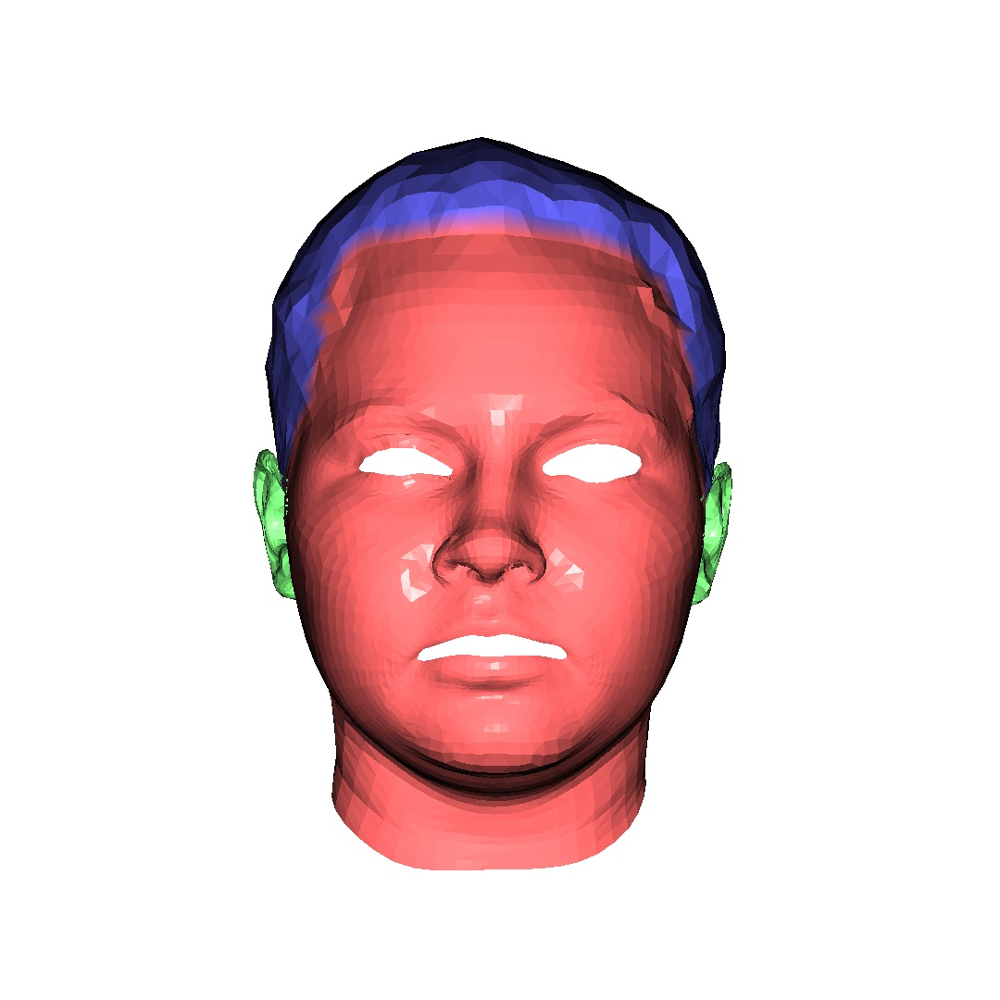
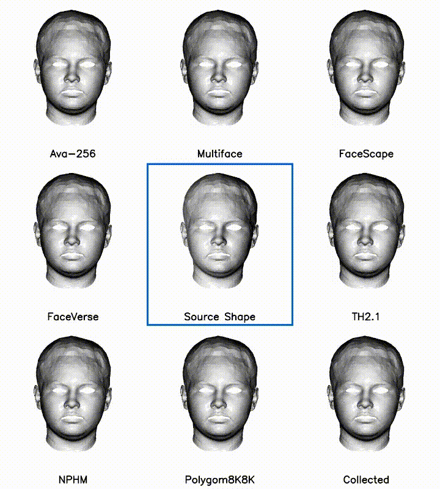
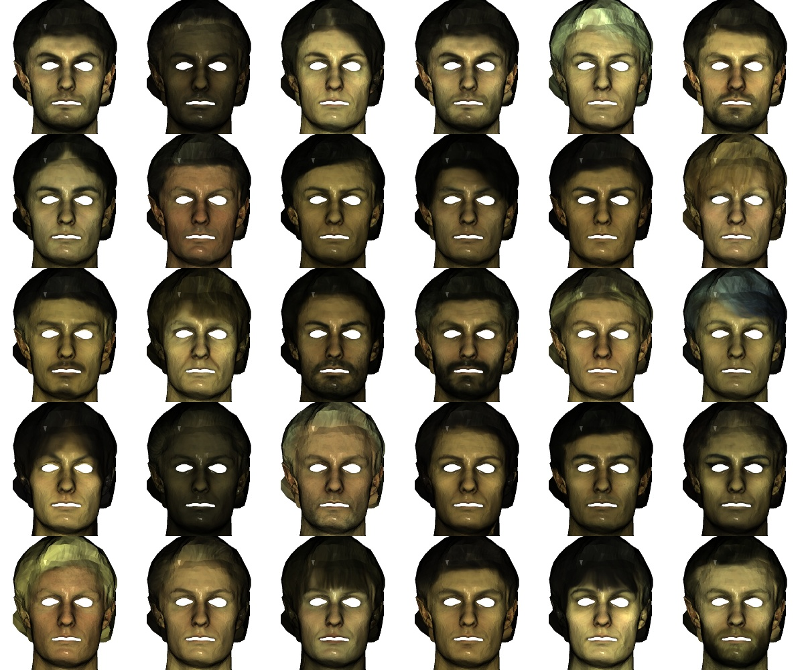
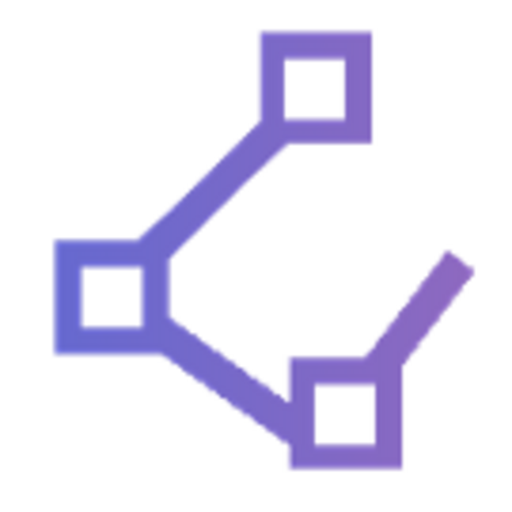

# METHA : Meta's topology-based (Ava-256, Multiface) Template model for Head Avatar


## Research purpose ONLY, non-commercial !!

## Introduction

This repository provides a **[FLAME](https://flame.is.tue.mpg.de/)-style linear PCA head template model** built to enhance the usability of Meta's publicly released datasets such as **awesome [Ava-256](https://github.com/facebookresearch/ava-256)** and **[Multiface](https://github.com/facebookresearch/multiface)**. Thank you Meta!

The model inherits the **exact mesh topology** from Ava-256 and Multiface. For streamlined processing and focused facial modeling, only the **eyeballs** and **mouth interior** regions have been intentionally removed.

This template serves as a lightweight, adaptable foundation for tasks involving facial shape modeling, expression analysis, and identity transfer.


## Building Process

### Topology

The topology was constructed through the following steps:

1. **Starting from Meta's topology**  
   All meshes follow Meta’s standard mesh topology, consisting of **7,306 vertices** and **10,936 faces**.

2. **Removing non-essential inner structures**  
   The **eyeball** and **mouth interior** regions are excluded, reducing the mesh to **5,509 vertices** and **10,809 faces**.

3. **Cleaning irrelevant geometry for head-only modeling**  
   Additional regions—such as parts of the mesh connected to clothing—are removed to isolate the head structure.  
   The final topology contains **5,095 vertices** and **9,961 faces**.

### Data collection

1. [Ava-256](https://github.com/facebookresearch/ava-256)
2. [Multiface](https://github.com/facebookresearch/multiface)
3. [Polygom8K8K](https://huggingface.co/datasets/polygom-team/8K8K)
4. Personally collected Korean head scan

In addition to Ava-256 and Multiface, I incorporated the Polygom8K8K dataset and a custom-collected Korean head scan dataset.
Both the Polygom8K8K and the custom scans were carefully registered to Meta's topology and refined accordingly.

### Local PCA


I divided the full head topology into three distinct regions:

- **Face** : 300 Shape (ID) and 300 Expression coefficients
- **Hair** : 300 Shape coefficients
- **Ears** : 100 Shape coefficients

For each region, a separate **local PCA model** was trained.

This design choice was made to address limitations found in the additional datasets (e.g., **Polygom8K8K**, custom scans), where:

- Some scans **lacked hair regions entirely**
- Others had **incomplete or corrupted ear geometry**

Instead of discarding such data, I selectively utilized the **valid regions**, enabling robust modeling even with **partial meshes**.


## Model Representational Power


I observed that the model demonstrates **sufficient expressiveness** when applied to various **publicly available 3D head scans**.

- When trained **only on Ava-256 and Multiface**, the model lacked diversity in East Asian facial features due to their underrepresentation.
- As a result, it showed **limited expressiveness** on datasets such as:
  - **FaceVerse**
  - **FaceScape**
  - **TH2.1**

To address this, I incorporated:
- **Polygom8K8K**, and
- Our **custom Korean head scan dataset**

These datasets contain a high proportion of **East Asian subjects**, enabling the model to learn stronger priors for East Asian faces and resulting in **significantly improved expressiveness** across diverse identities.



For the **hair region**, various hairstyles can be generated through **linear interpolation of shape coefficients**.

However, since the **hair region mask cannot be universally defined across all subjects**, some **artifacts or discontinuities may appear near the region boundaries**.  
This is a known limitation, and future improvements may involve:
- Applying **blending weights** across region boundaries, or  
- Redefining the region with an **overlapping boundary strategy**.

The example below shows results from simple **coefficient interpolation** without any regularization or constraints applied.



Of course, per-vertex UV mapping from Meta's topology has been incorporated into METHA!

Any texture map from Ava-256 and Multiface can be loaded into METHA.

## Usage

To be updated ! 

This is my personal toy project for helping my future research. Therefore, the completeness can be low. 

After checking the robustness and its representative power, I will update the full codes.


## Citation

```
@article{martinez2024codec,
  author = {Julieta Martinez and Emily Kim and Javier Romero and Timur Bagautdinov and Shunsuke Saito and Shoou-I Yu and Stuart Anderson and Michael Zollhöfer and Te-Li Wang and Shaojie Bai and Chenghui Li and Shih-En Wei and Rohan Joshi and Wyatt Borsos and Tomas Simon and Jason Saragih and Paul Theodosis and Alexander Greene and Anjani Josyula and Silvio Mano Maeta and Andrew I. Jewett and Simon Venshtain and Christopher Heilman and Yueh-Tung Chen and Sidi Fu and Mohamed Ezzeldin A. Elshaer and Tingfang Du and Longhua Wu and Shen-Chi Chen and Kai Kang and Michael Wu and Youssef Emad and Steven Longay and Ashley Brewer and Hitesh Shah and James Booth and Taylor Koska and Kayla Haidle and Matt Andromalos and Joanna Hsu and Thomas Dauer and Peter Selednik and Tim Godisart and Scott Ardisson and Matthew Cipperly and Ben Humberston and Lon Farr and Bob Hansen and Peihong Guo and Dave Braun and Steven Krenn and He Wen and Lucas Evans and Natalia Fadeeva and Matthew Stewart and Gabriel Schwartz and Divam Gupta and Gyeongsik Moon and Kaiwen Guo and Yuan Dong and Yichen Xu and Takaaki Shiratori and Fabian Prada and Bernardo R. Pires and Bo Peng and Julia Buffalini and Autumn Trimble and Kevyn McPhail and Melissa Schoeller and Yaser Sheikh},
  title = {{Codec Avatar Studio: Paired Human Captures for Complete, Driveable, and Generalizable Avatars}},
  year = {2024},
  journal = {NeurIPS Track on Datasets and Benchmarks},
}

@inproceedings{wuu2022multiface,
  title={Multiface: A Dataset for Neural Face Rendering},
  author = {Wuu, Cheng-hsin and Zheng, Ningyuan and Ardisson, Scott and Bali, Rohan and Belko, Danielle and Brockmeyer, Eric and Evans, Lucas and Godisart, Timothy and Ha, Hyowon and Huang, Xuhua and Hypes, Alexander and Koska, Taylor and Krenn, Steven and Lombardi, Stephen and Luo, Xiaomin and McPhail, Kevyn and Millerschoen, Laura and Perdoch, Michal and Pitts, Mark and Richard, Alexander and Saragih, Jason and Saragih, Junko and Shiratori, Takaaki and Simon, Tomas and Stewart, Matt and Trimble, Autumn and Weng, Xinshuo and Whitewolf, David and Wu, Chenglei and Yu, Shoou-I and Sheikh, Yaser},
  booktitle={arXiv},
  year={2022},
  doi = {10.48550/ARXIV.2207.11243},
  url = {https://arxiv.org/abs/2207.11243}
}
```

## Support
<p align="center">
  
  <br/>
  <em>Polygom</em>
</p>
