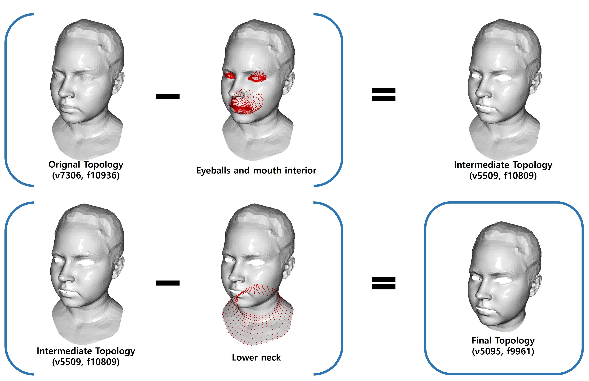

# METHA : Meta's topology-based (Ava-256, Multiface) Template model for Head Avatar

---
## Research purpose ONLY, non-commercial !!

## Introduction

This repository provides a **[FLAME](https://flame.is.tue.mpg.de/)-style linear PCA head template model** built to enhance the usability of Meta's publicly released datasets such as **awesome [Ava-256](https://github.com/facebookresearch/ava-256)** and **[Multiface](https://github.com/facebookresearch/multiface)**. Thank you Meta!

The model inherits the **exact mesh topology** from Ava-256 and Multiface. For streamlined processing and focused facial modeling, only the **eyeballs** and **mouth interior** regions have been intentionally removed.

This template serves as a lightweight, adaptable foundation for tasks involving facial shape modeling, expression analysis, and identity transfer.

## Building Process

### Topology

The topology was constructed through the following steps:

1. **Starting from Meta's topology**  
   All meshes follow Meta’s standard mesh topology, consisting of **7,306 vertices** and **10,936 faces**.

2. **Removing non-essential inner structures**  
   The **eyeball** and **mouth interior** regions are excluded, reducing the mesh to **5,509 vertices** and **10,809 faces**.

3. **Cleaning irrelevant geometry for head-only modeling**  
   Additional regions—such as parts of the mesh connected to clothing—are removed to isolate the head structure.  
   The final topology contains **5,095 vertices** and **9,961 faces**.

### Data collection

1. [Ava-256](https://github.com/facebookresearch/ava-256)
2. [Multiface](https://github.com/facebookresearch/multiface)
3. [Polygom8K8K](https://huggingface.co/datasets/polygom-team/8K8K)
4. Personally collected Korean head scan

In addition to Ava-256 and Multiface, we incorporated the Polygom8K8K dataset and a custom-collected Korean head scan dataset.
Both the Polygom8K8K and the custom scans were carefully registered to Meta's topology and refined accordingly.

## Model Representational Power

<video src="assets/tiled.mp4" autoplay loop muted playsinline style="width:100%; max-width:1200px;"></video>
